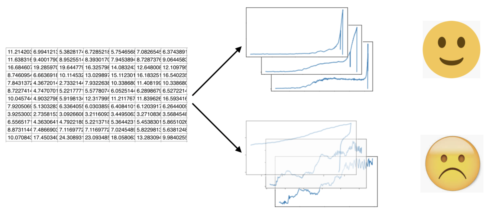
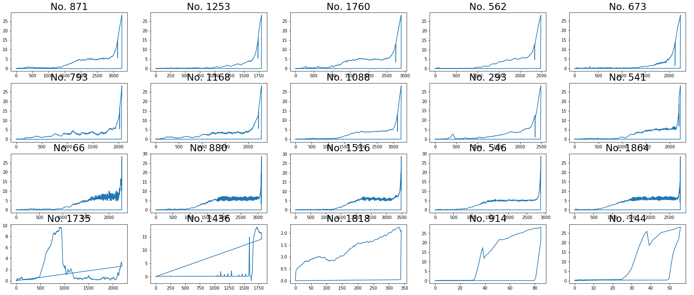

# nutAnomalyDetect

此项目致力于将机器学习(深度学习)应用到传统机械生产领域，具体地，对螺丝拧紧过程中产生的时序数据进行分析，预判可能存在的时序序列。
---

### 项目流程

--- 

### Idea

- 特征提取
   - LSTM-AE、传统采样两种方式
- 无监督学习任务
   - 在缺乏标注数据的情况下，使用[谱聚类](https://en.wikipedia.org/wiki/Spectral_clustering)进行类别划分；
   - 谱聚类在多特征数据上表现好于K-means，对数据分布有更广的适用；
   - 谱聚类基于图，无法直接对新样本预测，因此训练一个新的分类器。
--- 

### 实验结果

- 特征提取

- 聚类结果(4 clusters)

--- 

### 开发日志

01/03/2019

LSTM return_sequence=Ture，返回每个时间步的计算结果

--- 

15/03/2019

谱聚类相似矩阵计算，高斯RBF sigma设置缺乏指导，选择Pearson相关系数、Bray-Curtis Distance、Earth Mover Distance的加权平均

--- 

29/03/2019 

解决bootstrap选项卡CSS样式丢失问题。bootstrap3代码和4的css不兼容。

--- 

31/03/2019

关于Java调用Python代码的几种方式。

1st 使用Jpython等Java实现的Python Interpreter，缺点是很多第三方包没有

2nd [进程通信](https://www.cnblogs.com/maosonglin/p/9397257.html)

3rd 使用Runtime执行cmd命令，嵌入Python参数。这种方式要注意的问题是IDE比如Idea在首次编辑Python代码要求下载Plugin，记得**配置合适的Interpreter**。
我的Python环境比较乱，有OS X自带的Python2、自己装了从没用过的Python3、主力开发的基于Virtualenv的P3、和最近刚装的Conda3...开始没注意配置Interpreter，
使用没有包的P3，程序执行异常。

web开发js文件会缓存，因此开发阶段需要服务器端控制强制加载静态资源

---

01/04/2019

使用Bootstrap File Input同步上传的方式接收数据，注意[MultipartFile类型的参数上边一定要写@RequestParam(“xxx”)](https://blog.csdn.net/CSDN19951017/article/details/84840325)
回调函数调用异常

---

05/04/2019

使用Bootstrap File Input的异步上传

